# ScottyPrime

Welcome to ScottyPrime! This 3D graphics software package includes components for interactive mesh editing, realistic path tracing, and dynamic animation. It is built on a code skeleton provided by [cmu&#39;s computer graphics course](http://15462.courses.cs.cmu.edu/fall2021/).

You can visit cmu's [documentation website here](https://cmu-graphics.github.io/Scotty3D/).

## Mesh Editor

This part of the applicaton provides the user with wide toolkit of modeling operations. What I implemented was mostly on the halfedge data structure pointers reassignments (connectivity) and calculations for vertex positions (geometry).

### Local operations

below are some examples of the implemented local operations.

| Face Operations |            Illustration            |            GIF from App            |
| :------------------: | :--------------------------------: | :--------------------------------: |
|       Collapse       | 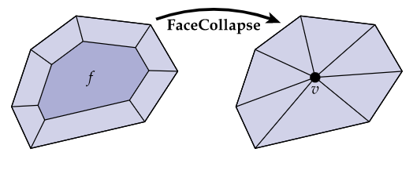 | 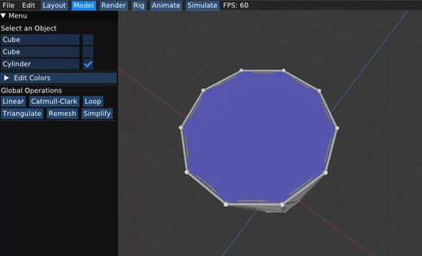 |
|        Inset         | 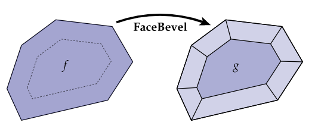 | 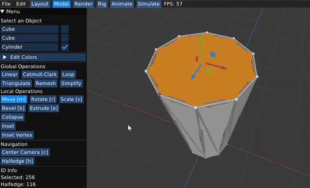 |
|       Extrude        | 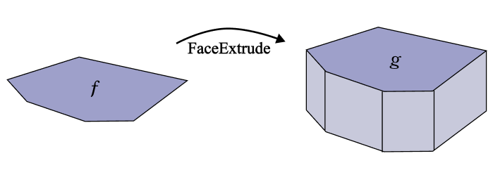 | 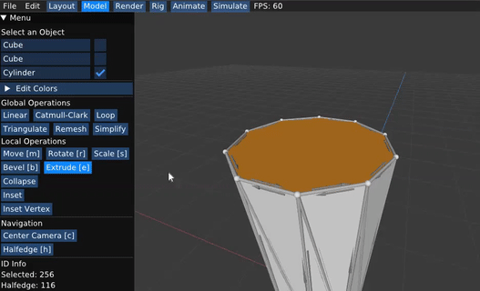 |
|        Bevel         | 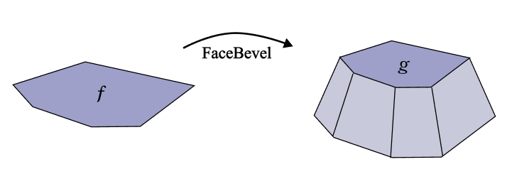 |  |
|  Insert Vertex  | 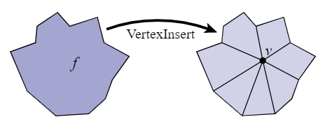 |  |

| Edge Operations |            Illustration            |                    GIF from App                     |
| :------------------: | :--------------------------------: | :-------------------------------------------------: |
|       Collapse       | 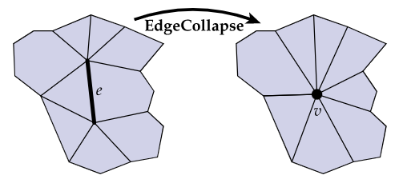 | 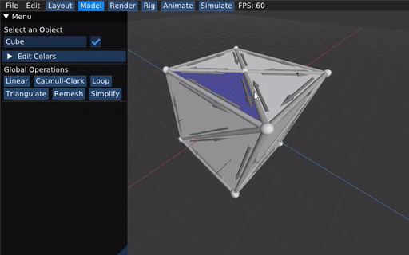 |
|        Erase         | 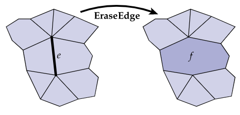 | 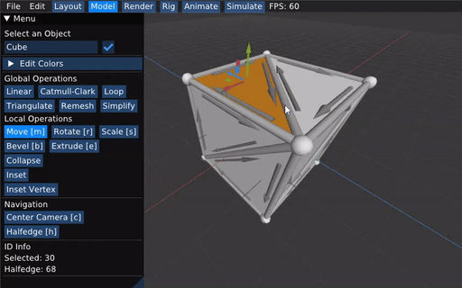 |
|        Split         | 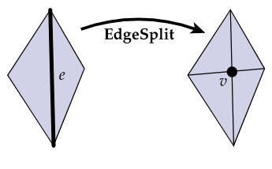 | 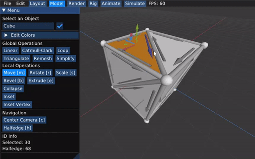 |
|         Flip         | 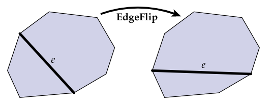 | 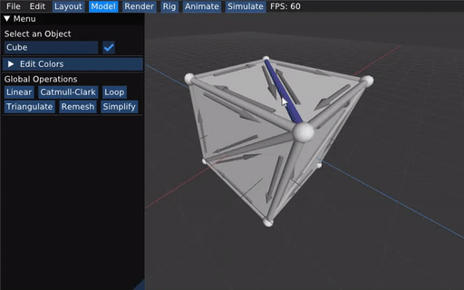 |
|        Bevel         | 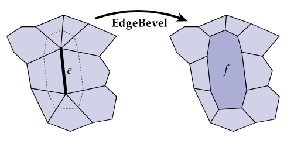 |                Yet to be Implemented                |

| Vertex Operations |             Illustration              |                    GIF from App                     |
| :--------------------: | :-----------------------------------: | :-------------------------------------------------: |
|         Erase          | 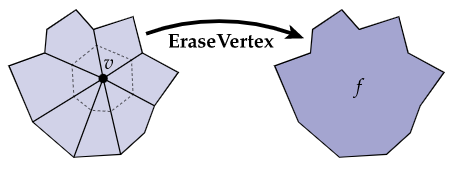 | 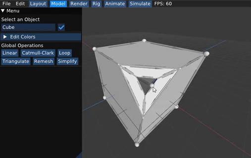 |
|         Bevel          |  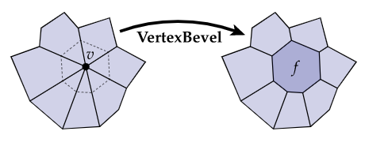   | 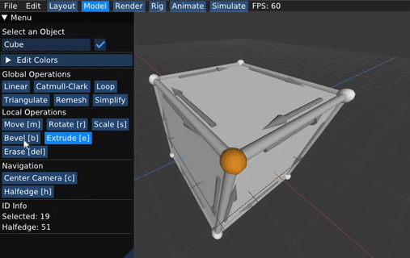 |
|        Extrude         |  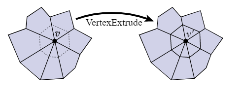   | 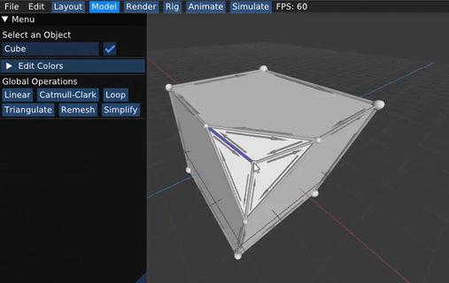 |

### Global operations

below are some examples of the implemented global operations.

|                                     Global Operations                                      |                    Illustration                     |                    GIF from App                     |
| :---------------------------------------------------------------------------------------------: | :-------------------------------------------------: | :-------------------------------------------------: |
|                                          Triangulation                                          | 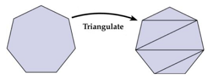 | 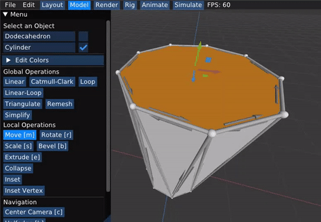 |
|                                     Linear Subdivision                                     |        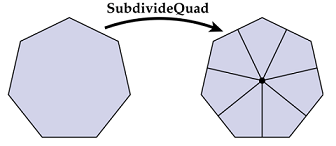        | 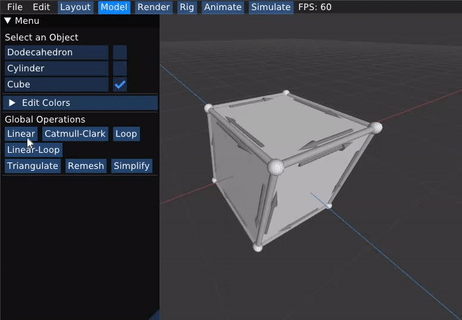 |
|                                 Catmull-Clark Subdivision                                  |        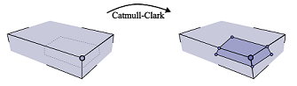        | 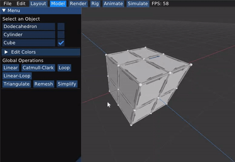 |
|                                  Linear Loop Subdivision                                   |        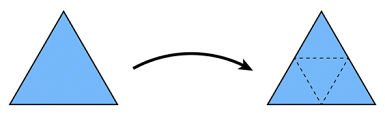        |  |
|                                      Loop Subdivision                                      |        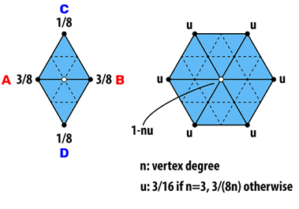        | 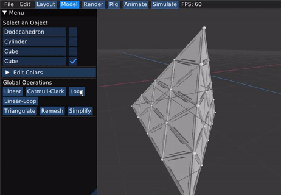 |
|     [Isotropic Remeshing](https://www.graphics.rwth-aachen.de/media/papers/remeshing1.pdf)      |        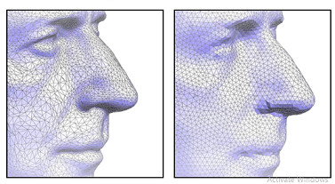        |                Yet to be Implemented                |
| [Quadratic  Error Simplification](http://www.cs.cmu.edu/~./garland/quadrics/quadrics.html) |        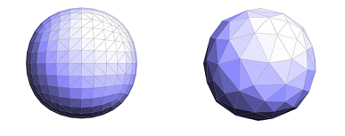        |                Yet to be Implemented                |
