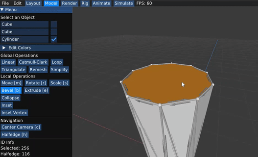
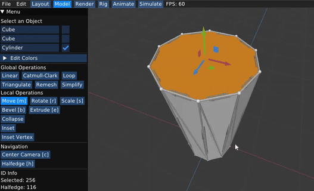

# ScottyPrime

Welcome to ScottyPrime! This 3D graphics software package includes components for interactive mesh editing, realistic path tracing, and dynamic animation. It is built on a code skeleton provided by [cmu&#39;s computer graphics course](http://15462.courses.cs.cmu.edu/fall2021/).

You can visit cmu's [documentation websithere](https://cmu-graphics.github.io/Scotty3D/).

## Results

### Mesh Editing

This part of the applicaton provides the user with wide toolkit of modeling operations. What I implemented was mostly on the halfedge data structure pointers reassignments (connectivity) and calculations for vertex positions (geometry).

#### Local operations

below are some examples of the implemented local operations.

| Face Operations |             Illustration             |                                                                 GIF from App                                                                 |
| :------------------: | :----------------------------------: | :------------------------------------------------------------------------------------------------------------------------------------------: |
|       Collapse       |  |                                                                                            |
|        Inset        |  |                                                                                            |
|       Extrude       |    |                                                                                            |
|        Bevel        |    |  |
|  Insert Vertex  |  |  |

| Edge Operations |             Illustration             |     GIF from App     |
| :------------------: | :----------------------------------: | :-------------------: |
|       Collapse       |  |                      |
|        Erase        |  |                      |
|        Split        |  |                      |
|         Flip         |  |                      |
|        Bevel        |  | Yet to be Implemented |
